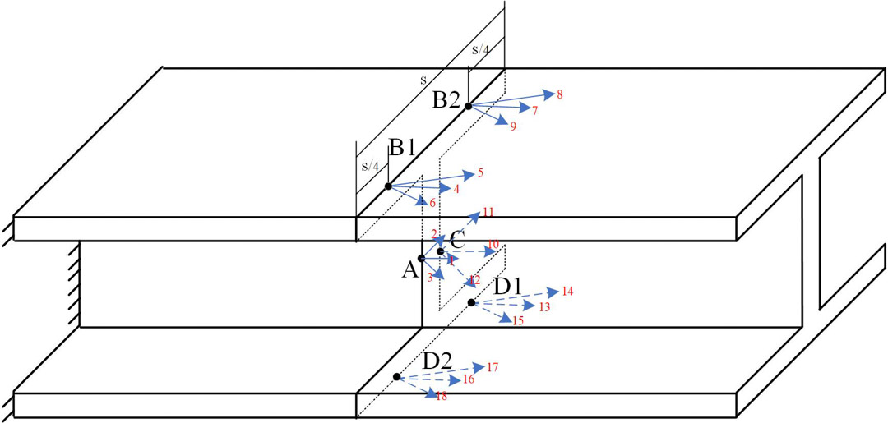

# Research on load measurement and identification methods for piping systems

**2020.06-2021.06**

---

**Project content**:
Calculate the cross-sectional load and conduct experimental verification based on multi-point strain data on the pipeline ring surface for three typical types of pipeline components: I-beams, square steels, and circular pipes.

 
Circle pipe

---

 
H pipe

---

 
Squre pipe

