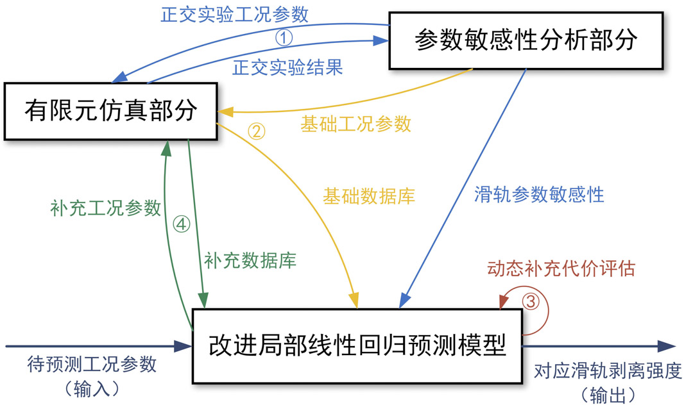
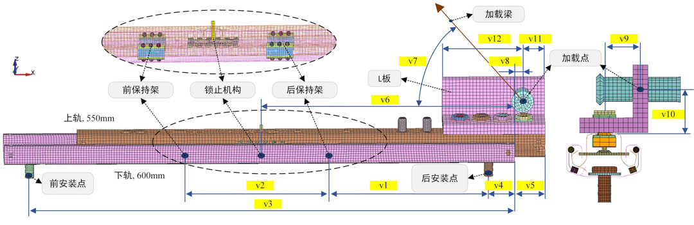

# Development of a predictive system for studying the robustness of car seat slide rail shapes

**2021.09 - 2022.09**

---

 
The flowchart of slide peeling predition.

 
The FEM of car seat slide.

