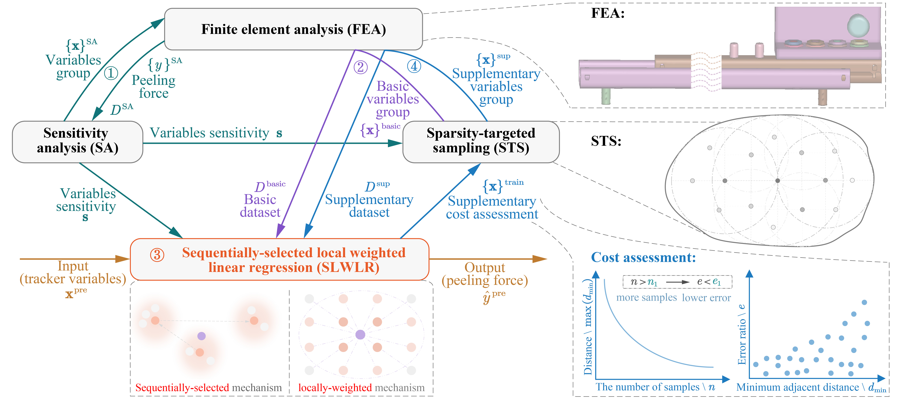
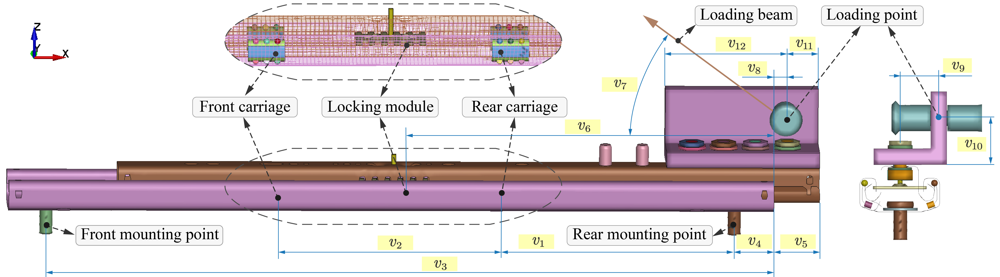
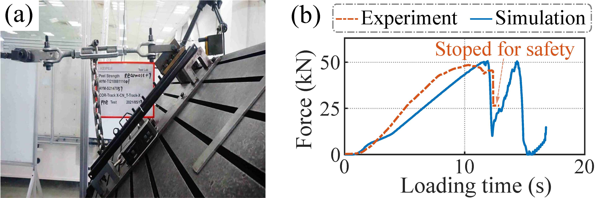
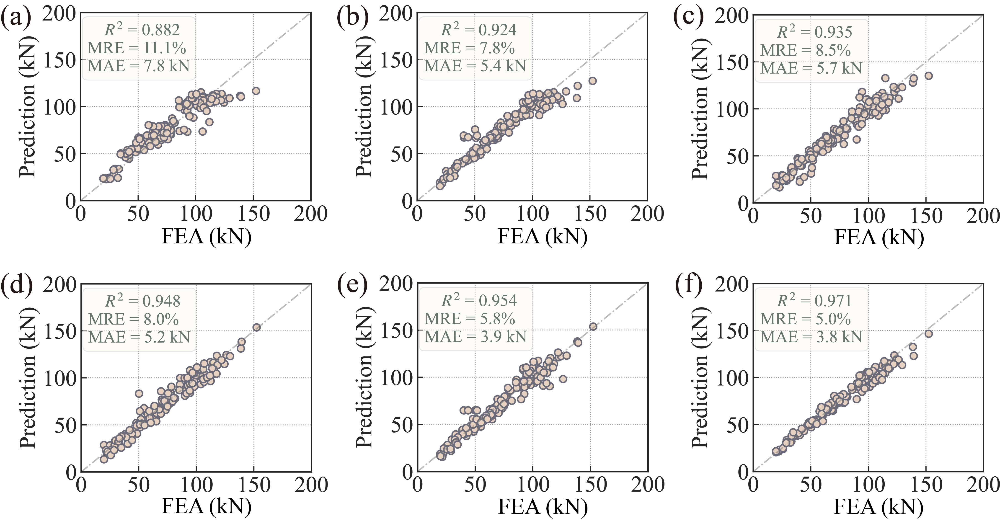

# A systematic framework of constructing surrogate model for slider track peeling strength prediction

> X. Dong\*, **Q. Chen**\*, et al., “A systematic framework of constructing surrogate model for slider track peeling strength prediction,” *Science China Technological Sciences*, 2024. (Accepted)  
> **陈钱**, 等. 基于迭代式局部加权线性回归的汽车座椅滑轨剥离强度预测[J]. *机械工程学报*, 2024.  (返修)  
>X. Dong, **Q. Chen**, et al., "Data-driven-based automobile seat slide rail peel strength prediction method", [CN116822292A](https://patents.google.com/patent/CN116822292A/en?oq=CN116822292A), Sep. 29, 2023. 

##  Abstract
Peeling strength can comprehensively reflect the slider track safety and plays a crucial role for car seat safety assessments. Current methods for determining slider peeling strength primarily involve physical testing and numerical simulation. However, these methods encounter the potential challenges of high costs and overlong time consumption which have not been adequately addressed. Therefore, the efficient and low-cost surrogate model emerges as a promising solution. Nevertheless, currently used surrogate models suffers from inefficiencies and complexity in data sampling, lack of robustness in local model predictions, and isolation between data sampling and model prediction. To overcome these challenges, this paper aims to set up a systematic framework for slider track peeling strength prediction, including sensitivity analysis, dataset sampling, and model prediction. Specifically, the interpretable linear regression is performed to identify the sensitivity of various geometric variables to peeling strength. Based on the variable sensitivity, a distance metric is constructed to measure the disparity of different variable groups. Then, the sparsity-targeted sampling (STS) is proposed to formulate a representative dataset. Finally, the sequentially-selected local weighted linear regression (SLWLR) is designed to achieve accurate track peeling strength prediction. Additionally, a quantitative cost assessment of supplementary dataset is proposed by utilizing the minimum adjacent sample distance as a mediator. Experimental results validate the efficacy of sequential selection and the weighting mechanism in enhancing localization robustness. Furthermore, the proposed SLWLR method surpasses similar approaches and other common surrogate methods in terms of prediction performance and data quantity requirements.

**Keywords:** Slider track, Peeling strength, Surrogate model, Sensitivity analysis, Data sampling, Local weighted linear regression

## Framework
The holistic systematic framework for slider peeling strength prediction is illustrated in Figure 1. This framework comprises four main components: sensitivity analysis (SA), sparsity-targeted sampling (STS), sequentially-selected locally weighted linear regression (SLWLR), and supplementary cost assessment.The workflow of this framework is as follows:

* **Sensitivity analysis:**  Acquire a mini batch dataset $D^{\rm SA}$ and calculate the sensitivity $\mathbf{s} \in \mathbb{R}^p$ for each variable in the slider track, which forms the basis for the weighted distance metric $d_\mathbf{s} (\cdot,\cdot)$ utilized in subsequent STS and SLWLR algorithms.

* **Sparsity-targeted sampling:** With the weighted distance metric $d_\mathbf{s} (\cdot,\cdot)$ and current training samples $\{\mathbf{x}\}^{\rm train}$, STS iteratively explores sparse regions in the variable space and conducts sampling within these regions, progressively reducing the potential sparsity and aiming to construct a representative dataset.

* **Sequentially-selected local weighted linear regression:** With the weighted distance metric  $d_\mathbf{s} (\cdot,\cdot)$, current training dataset $D^{\rm train}$ and test dataset $D^{\rm test}$, SLWLR considers the repulsive effects from already selected samples and sequentially selects $k$ neighbor samples $\tilde{D}^k(\mathbf{x}^{\rm pre})$ for each test sample $\mathbf{x}^{\rm pre} \in D^{\rm test}$.  Subsequently, SLWLR assigns different weights and predicts the peeling strength $\hat y^{\rm pre}$ of $\mathbf{x}^{\rm pre}$ based on $\tilde{D}^k(\mathbf{x}^{\rm pre})$, similar to the approach utilized by LWLR.

* **upplementary cost assessment:** Leveraging the minimum adjacent sample distance as a mediator, this assessment establish the relationship between the performance improvement of predicting peeling strengths and the number of required supplementary samples. This constitutes a quantitative assessment between the supplementary cost and the targeted accuracy.

 
Figure 1. The holistic systematic framework of constructing surrogate model for slider track peeling strength prediction.

## FEA of Slide Tracker

To simulate the peeling process of the slider track, we constructed a model as depicted in Figure 2, using LS-DYNA, a commercial FEA software. This model comprises a 550 mm upper rail, a 600 mm lower rail, a locking module, two bearings with carriages, along with a loading beam and other auxiliary components.

The upper and lower rails of the slider track are discretized into tetrahedral meshes with dimensions of 3.5 mm $\times$ 3.5 mm. These meshes are configured as 5-point integration, plane-symmetric shell elements, facilitating a balance between simulation precision and computational efficiency. The material of the upper and lower rails is alloy steel, characterized by a density of 7.85 $\rm g/cm^3$, Young's modulus of 210 GPa, and a Poisson's ratio of 0.3.
Concerning contact modeling, a global contact friction coefficient of 0.1 and a global viscosity damping coefficient of 20 are specified. Fixed constraints are applied at the front and rear mounting points of the lower  slider track. Displacement excitation is imposed along the direction of the loading beam, and LS-DYNA solver is invoked for explicit calculation.

The simulation results indicate that variables v5 (relative distance between the upper and lower rails), v7 (loading direction), v8 (loading position), and v9 (eccentricity) have a significant impact on the peel strength, which is in line with the prior knowledge of sliding rails.

 
Figure 2. The finite element model of the slider track and the geometric variables selected as the design variable group X.
 &nbsp;

To validate the effectiveness of the slider track FEA model, a benchmark experiment is conducted, and the experimental result is compared with the FEA result. The geometric variables for both are consistent, and the experimental settings, along with the peeling strength curve, are illustrated in Fig. 3.
The peeling strength of the physical slider track is measured at 48.5 kN, while the corresponding FEA simulation yields a value of 50.6 kN. The resulting error ratio under these conditions is 4.3\%. Furthermore, the peeling strength curves of them are closely aligned, affirming the reliability of the FEA simulation.

 
Figure 3. Experimental rig and peeling strength curve. (a) Experimental rig of physical slider track. (b) Peeling strength curve of the physical slider peeling experiment and its corresponding FEA simulation.

## Dataset Formulation and SLWLR prediction
To validate the superiority of the proposed SLWLR method over similar approaches in predicting the peel strength of sliding rails, a comparison is conducted between SLWLR and currently popular surrogate modeling techniques. A total of 240 sets of operating condition parameters are sampled using a sparsity-oriented sampling algorithm as the training dataset, and an additional 150 sets of operating condition parameters are randomly sampled from the sliding rail operating condition variable space to serve as the testing dataset. Both datasets are constructed by calculating the corresponding peel strength of the sliding rail for each set of operating condition parameters through finite element simulations, as illustrated in Figure 2. The performance of the five comparison methods and the proposed SLWLR algorithm in predicting the peel strength of sliding rails is presented in Figure 4.

 
Figure 4. The performance of different methods  trained on the full dataset comprising 240 samples. (a) kNN,  (b) SVR, (c) RBF, (d) MLP, (e) Kriging, (f) SLWLR. &nbsp;

The results demonstrate that kNN exhibits the poorest performance, while SVR and RBF show some improvement. MLP and Kriging outperform the first three methods, but the proposed SLWLR method surpasses all others in terms of accuracy metrics (i.e., R2, MRE, MAE), achieving closer proximity to the true values (i.e., finite element simulation results).

Furthermore, we conducted a series of ablation experiments to validate the effectiveness of individual components within the approach, including sensitivity analysis (SA), sparsity-targeted sampling (STS), sequentially-selected locally weighted linear regression (SLWLR). For specific results, please refer to the original article in *SCIENCE CHINA Technological Science*.

## Conclusion
To overcome the high cost, time-consuming nature, and insufficiently comprehensive assessment involved in obtaining slider track peeling strength, we propose a systematic surrogate model construction framework encompassing sensitivity analysis, dataset sampling, and model prediction. Through a series of experiments, we validate the effectiveness of the proposed method and draw the following conclusions:

* SLWLR, through sequential selection of adjacent samples and distance-based weighting mechanism, effectively avoids the over-aggregation of adjacent samples when the adjacent sample number $k$ is small and mitigates the negative effects of distant samples as $k$ increases. This overcomes the sensitivity issue to the localization (i.e., $k$), and its prediction performance is significantly better than similar local methods.

* Slider track peeling strength prediction is a complex, multi-factor, highly coupled, and nonlinear problem. Considering the data limitation due to exorbitant computational cost, the SLWLR method outperforms other surrogate model methods in terms of prediction accuracy and data quantity requirements.

* Considering data acquisition costs, the effectiveness of the proposed STS method in dataset construction is validated through sampling estimation and a indirect comparison.

* Finally, the established surrogate model demonstrates feasibility and effectiveness in slider track peeling strength prediction task. In the simulated test dataset of 150 randomly samples, the average absolute error is 3.3 kN, the average ralative error is 4.3\%, and in three physical test scenarios, the absolute error is within 2 kN, and the ralative error is within 4\%.