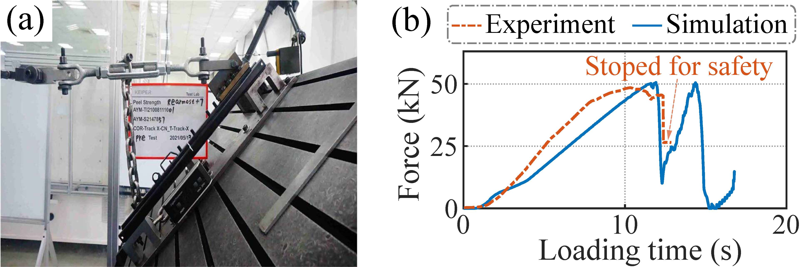

# 面向滑轨剥离强度预测的系统性代理模型构建框架

> X. Dong\*, **Q. Chen**\*, et al., “A systematic framework of constructing surrogate model for slider track peeling strength prediction,” *Science China Technological Sciences*, Sep. 2024, doi: [10.1007/s11431-024-2764-5](https://doi.org/10.1007/s11431-024-2764-5).   
> **陈钱**, 等. 基于迭代式局部加权线性回归的汽车座椅滑轨剥离强度预测[J]. *机械工程学报*, 2024. (复审)  
>X. Dong, **Q. Chen**, et al., "Data-driven-based automobile seat slide rail peel strength prediction method", [CN116822292A](https://patents.google.com/patent/CN116822292A/en?oq=CN116822292A), Sep. 29, 2023. 

##  摘要
剥离强度能够全面反映滑轨的安全性和可靠性，在汽车座椅安全评估中起到关键作用。当前滑轨剥离强度的获取方法主要是物理测试和数值模拟两种，但这些方法面临着高成本和高耗时等问题。以高精度、低成本为代表的代理模型，有望成为滑轨剥离强度预测的有效解决方案。然而，目前使用的代理模型在数据采样方面不够有效，在模型预测方面不够鲁棒，以及数据采样和模型预测之间缺少有机融合。为克服上述挑战，建立了一个面向滑轨剥离强度预测的系统性代理模型构建框架，该框架包括敏感性分析、数据集采样和模型预测三部分。具体来说，首先进行可解释的线性回归，识别各种几何变量对剥离强度的敏感性。其次，基于变量敏感性，构建一个衡量不同变量组差异的距离度量。然后，提出稀疏性目标采样（sparsity-targeted sampling, STS）方法来制定代表性数据集。最后，设计了序列式局部加权线性回归（sequentially-selected local weighted linear regression, SLWLR），以实现准确的滑轨剥离强度预测。此外，利用最小相邻样本距离作为桥梁，实现数据集补充代价的定量评估。实验结果验证了序列式选择相邻样本和加权机制在增强预测方法鲁棒性的有效性。此外，所提出的SLWLR方法在预测性能和数据需求方面超越了同类方法和其他常见的代理模型方法，在模拟测试数据集中的平均绝对误差为3.3 kN。

**关键词：** 滑轨，剥离强度，代理模型，敏感性分析，数据采样，局部加权线性回归

## 框架
滑块剥离强度预测的整体系统框架如图1所示。该框架包含四个主要部分：敏感性分析 (sensitivity analysis, SA)、稀疏性目标采样(sparsity-targeted sampling, STS)、序列式局部加权线性回归(sequentially-selected locally weighted linear regression, SLWLR)和补充成本评估(supplementary cost assessment)。框架的工作流程如下：
1.	敏感性分析：获取一个小批量数据集，并计算滑块轨道中每个变量的敏感性，为后续稀疏性目标采样和序列式局部加权线性回归算法提供加权距离度量基础。
2.	稀疏性目标采样：使用加权距离度量和当前训练样本，稀疏性目标采样算法迭代地探索变量空间中的稀疏区域并在这些区域内进行采样，逐步减少潜在的稀疏性，从而构建一个具有代表性的数据集。
3.	序列式局部加权线性回归：使用加权距离度量、当前训练数据集和测试数据集，序列式局部加权线性回归算法考虑已选样本的排斥效应，并为每个待测样本顺序选择k个相邻样本。随后，序列式局部加权线性回归根据距离的远近为各相邻样本分配不同的权重，并对待测样本开展的剥离强度预测。
4.	补充代价评估：利用最小相邻样本距离作为桥梁，建立剥离强度预测精度提升与所需补充样本数量之间的关系，实现补充成本与目标精度之间的定量评估。

 
图1 滑轨剥离强度预测的整体系统框架

## 滑轨有限元分析（FEA）

有限元分析利用数学近似的方法，对真实物理系统进行仿真模拟。为了模拟滑轨的剥离过程，我们在有限元商业软件Lsdyna中建立如图2所示的汽车座椅手动滑轨有限元仿真模型，模型中包含550 mm上轨、600 mm下轨、锁止装置、保持架这类核心部件以及固定螺栓、L型加载板、加载梁等辅助部件。将滑轨上下轨划分为3.5mm*3.5mm的四面体网格，并设置为5点积分、平面对称shell单元，从而获得较好的模型仿真精度和计算速度。滑轨上下轨的材料为合金钢，其密度为7.85 g/cm3，杨氏模量为210 Gpa，泊松比为0.3。在模型接触方面，全局接触摩檫力系数设置为0.1，全局粘度阻尼系数设置为20。在滑轨的前后安装点出施加固定约束，沿着加载梁方向对加载梁施加位移激励，并调用Lsdyna求解器进行显式求解。在Intel Xeon@E5-2680 v3、64 G内存的服务器平台中调用8核进行并行计算，该滑轨有限元仿真模型的计算时间约16小时，是比较耗时的。

仿真结果表明变量v5（上下轨相对距离）、v7（加载方向）、v8（加载位置）、v9（偏心量）对剥离强度具有较大的影响，该结论与滑轨先验知识相符。

 
图2 滑轨的有限元模型以及所考虑的几何变量组 &nbsp;

此外，我们还做了如图3所示的实物对标实验。实物对标实验表明，所建立的FEA滑轨模型不仅在剥离力值上一致，而且在拉伸力曲线方面的吻合度也很好。这表明FEA滑轨模型是较为真实可靠的，能有效反映真实滑轨的剥离强度。

 
图3 滑轨剥离强度预测的整体系统框架

## 数据集构建及代理模型预测
为验证所提SLWLR方法相比与同类方法在滑轨剥离强度预测问题上的优越性，将SLWLR和当前流行的代理模型构建方法进行对比。通过稀疏性目标采样算法采样出240个工况参数组作为训练数据集，并从滑轨工况变量空间中额外地随机采样出150个工况参数组作为测试数据集。以上两个数据集的构建均通过图2所示的有限元仿真来计算这些工况参数组对应的滑轨剥离强度。5种对比方法与所提SLWLR算法在滑轨剥离强度预测问题上的表现如图4所示。

 
图4 不同预测方法在仿真数据集的性能表现。(a) kNN，(b) SVR，(c) RBF，(d) MLP，(e) Kriging，(f) SLWLR &nbsp;

从结果可以看出，kNN 的表现最差， SVR 和 RBF 的表现则有所提高。MLP 和 Kriging 的表现优于前面三种方法，而所提出的 SLWLR 方法在准确性指标（即R2、MRE、MAE）方面超越了所有其他方法，并且与真实值（即有限元仿真结果）更加接近。

此外，我们还进行了一系列消融实验，分别验证了敏感性分析 (SA)、稀疏性目标采样(STS)、序列式局部加权线性回归(SLWLR)各部分的有效性。具体结果请参考 *SCIENCE CHINA Technological Science* 原文。

## 总结
总结而言，滑轨剥离强度预测是一个多因素、高耦合、复杂非线性的问题，并且数据获取成本限制了数据集丰富程度，因此同类方法难以取得所提SLWLR方法的优异预测表现，SLWLR在预测性能指标方法和少样本学习方面都优于同类方法。