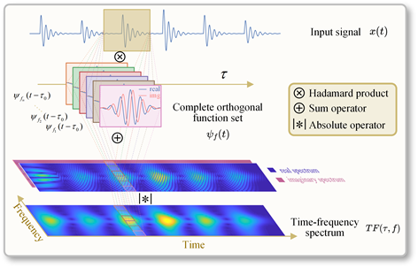
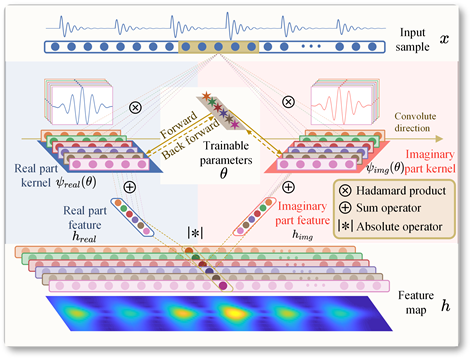
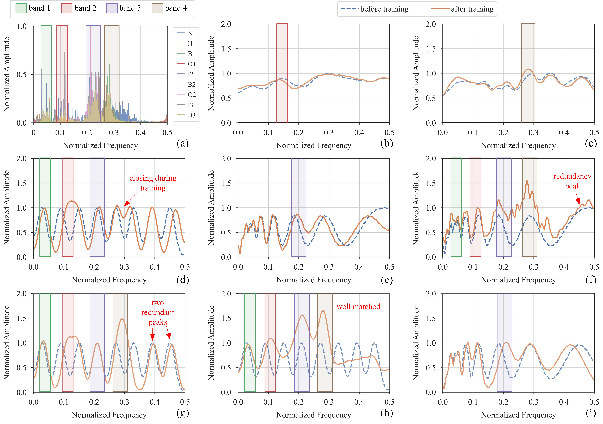
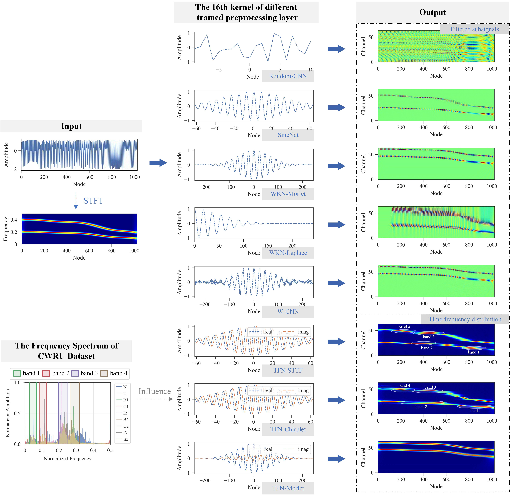

# TFN: An interpretable neural network with time-frequency transform embedded for intelligent fault diagnosis

> Q. Chen et al., “TFN: An interpretable neural network with time-frequency transform embedded for intelligent fault diagnosis,” Mechanical Systems and Signal Processing, vol. 207, p. 110952, Jan. 2024, doi: 10.1016/j.ymssp.2023.110952.

卷积神经网络（CNN）以其强大的特征提取和分类能力，被广泛应用于机械系统故障诊断之中。但CNN是一个典型的“黑箱模型”，不仅降低了智能诊断结果的可信性，还限制了在高可靠性要求故障诊断场景中的应用。为了解决这类问题，本文将具有明显物理意义的时频变换方法和传统卷积层相结合，提出具有优异可解释性的时频变换卷积层（TFconv）和时频变换网络（TFN），进而提出将TFN用于故障诊断的完整流程。一系列实验表明，TFN拥有良好的故障诊断能力，且能通过频谱分析解释出模型提取类别特征和做出判断的依据来源。此外，提出的TFconv具有良好的通用性，对于不同深度的CNN模型均适用。

## 时频变换和神经网络卷积层具有共同性

 
基于内积运算的时频变换方法

 
1维卷积层的运算过程

## TFN方法

### TFconv层的结构

以内积为基础的时频变换方法具有良好的物理可解释性，但不能对时频特征进行主动筛选，自适应地提取与故障类别相关的时频特征；而卷积神经网络能将原始样本自适应地提取为高维特征并进行分类和回归，具有效率高准确率高地特点，但存在“黑箱”问题，预测机制不够明晰。

结合卷积神经网络和时频变换两者的优点，我们基于CNN和时频变换中内积运算这一共同点，将时频变换嵌入了卷积神经网络的卷积层，并将其命名为TFconv层。

为模拟内积为基础的时频变换，TFconv层中每个卷积核都包含一个实部卷积核和一个虚部卷积核两部分，它们沿着长度方向对输入样本进行卷积，分别得到实部特征和虚部特征，然后对实部特征和虚部特征进行求模运算得到特征图作为TFconv层的输出，整个过程中各个通道之间相互独立。

 
所提出TFconv层的运算过程

总而言之，与传统的卷积层相比，提出的TFconv层具有三个特点：

* 传统的卷积层仅具有一个卷积过程，而TFconv层具有实部和虚部两个卷积过程；
* 传统的卷积层的卷积核权重是随机初始化的，而TFconv层的卷积核权重由给定的核函数决定；
* 传统的卷积层的训练参数为卷积核的权重，而TFconv层的训练参数为核函数中的频率因子。

### TFconv层的核函数

STTF、Chirplet和Morlet三种核函数被考虑到我们的框架中，三种核函数具备不同的滤波性质。

 
三种核函数的时域图和频域图

### TFconv层的可解释性

卷积层和信号处理的FIR滤波器是共同的，因此可以通过分析卷积层的幅频响应揭示神经网络对不同频段的关注程度。

 
幅频响应：(a) 随机卷积核的通道级幅频响应C-FR; (b) STTF卷积核的通道级幅频响应C-FR；(c) Morlet卷积核的通道级幅频响应C-FR；(d) 总体幅频响应O-FR.

### TFN应用于故障诊断的完整框架

 
TFN用于故障诊断的完整框架

## 实验

### 准确率方面

 
TFN和同类方法的准确率表现

### 可解释性方面

 
TFN和同类方法的可解释性表现-幅频响应

### 少样本学习方面

 
TFN和同类方法在少样本学习场景下的表现

### 收敛速度方面

 
TFN和同类方法在收敛速度上的表现

### 训练时间方面

 
TFN和同类方法在训练时间上的表现

### 和同类方法的区别方面

 
TFN和同类方法的区别：所提TFN是可学习的时频变换，得到的是时频能量分布；同类方法是多通道的带通滤波器，得到的是不同频段的滤波子信号。

## 总结

提出了能够自适应提取时频特征的可解释卷积层（TFconv），建立了将TFconv和现有的卷积神经网络进行拼接获得TFN模型并进行故障诊断的流程，提出了针对CNN卷积层的频响分析方法，最后在一系列机械设备故障诊断实验中验证了TFN具有良好的诊断准确率和可解释性。结论可总结为：

1. 将TFconv和现有的CNN进行拼接能够极大地提高模型在机械故障诊断地准确率；
2.  TFconv的加入，可以通过幅频响应分析，一定程度上解释卷积神经网络提取类别特征和做出判断的依据来源；
3. TFconv的核函数、通道数和组合方式对TFN的准确率表现具有重要影响，32通道的STFT-TFN能够在性能、效率和可解释性方面上达到综合最优。

在以后的研究中，我们会进一步研究TFconv核函数的运行机制和TFN模型搭建。