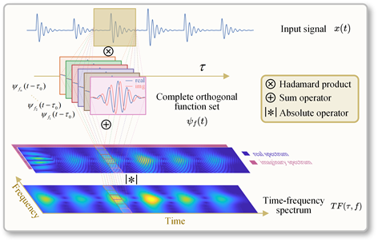
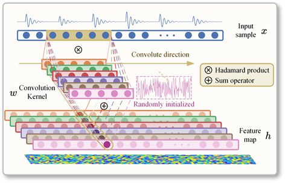
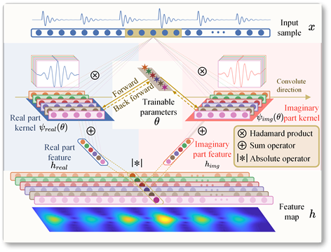
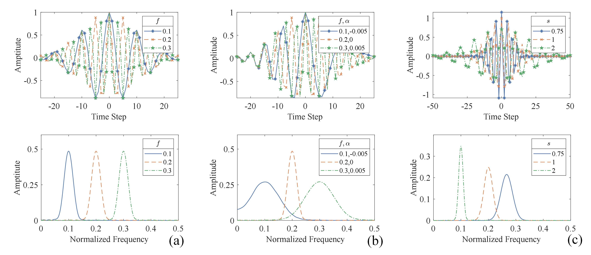
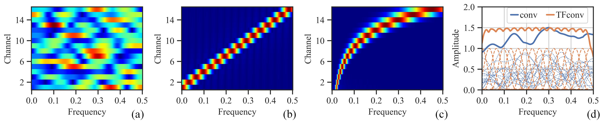
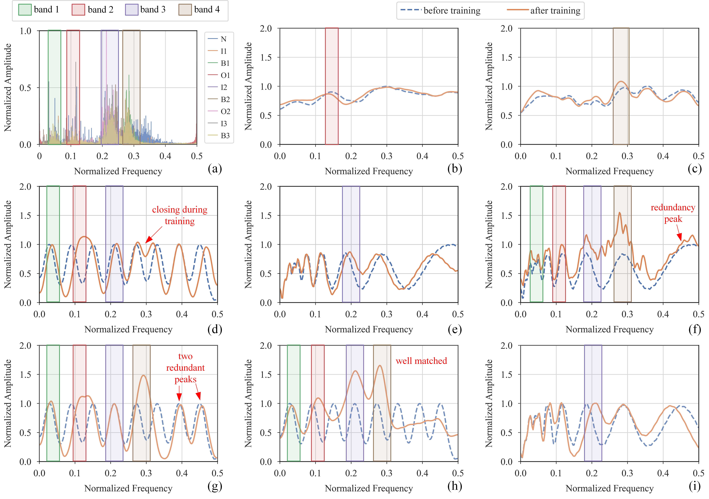
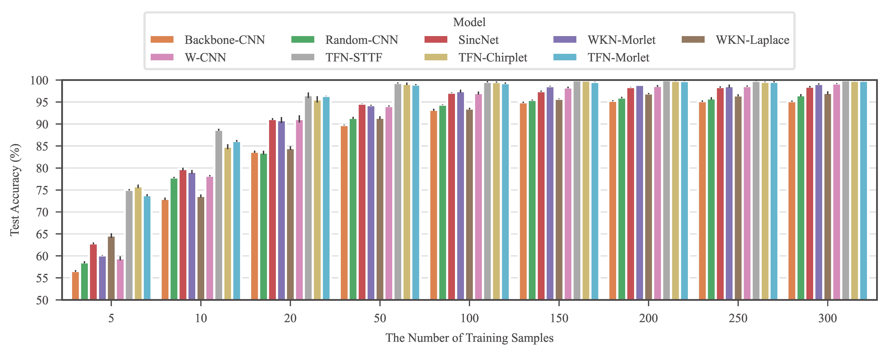
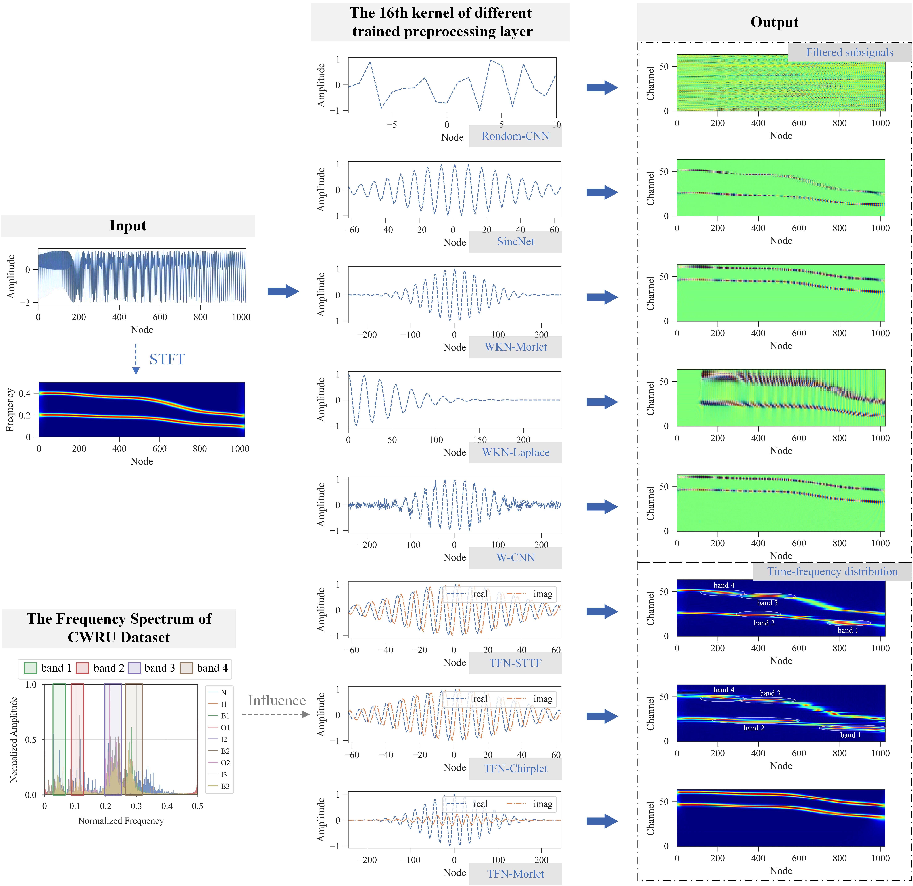

# TFN: An interpretable neural network with time-frequency transform embedded for intelligent fault diagnosis

> Q. Chen et al., “TFN: An interpretable neural network with time-frequency transform embedded for intelligent fault diagnosis,” Mechanical Systems and Signal Processing, vol. 207, p. 110952, Jan. 2024, [doi: 10.1016/j.ymssp.2023.110952](https://www.sciencedirect.com/science/article/pii/S0888327023008609).

## Abstract

Convolutional neural networks (CNNs) are widely used in fault diagnosis of mechanical systems due to their powerful feature extraction and classification capabilities. However, the CNN is a typical black-box model, and the mechanism of CNN's decision-making is not clear, which limits its application in high-reliability-required fault diagnosis scenarios. To tackle this issue,  we propose a novel interpretable neural network termed as time-frequency network (TFN), where the physically meaningful time-frequency transform (TFT) method is embedded into the traditional convolutional layer as a trainable preprocessing layer. This preprocessing layer named as time-frequency convolutional (TFconv) layer, is constrained by a well-designed kernel function to extract fault-related time-frequency information. It not only improves the diagnostic performance but also reveals the logical foundation of the CNN prediction in a frequency domain view. Different TFT methods correspond to different kernel functions of the TFconv layer. In this study, three typical TFT methods are considered to formulate the TFNs and their diagnostic effectiveness and interpretability are proved through three mechanical fault diagnosis experiments.  Experimental results also show that the proposed TFconv layer has outstanding advantages in convergence speed and few-shot scenarios, and can be easily generalized to other CNNs with different depths to improve their diagnostic performances.  The code of TFN is available on [https://github.com/ChenQian0618/TFN](https://github.com/ChenQian0618/TFN).

## Inner production: the common basis of Time-frequency transform and convolutional layer

 
The process of inner product based TFT.  &nbsp;

 
The process of traditional convolutional layer in CNN.

## Methodology of TFN

### Achitecture

The time-frequency transformation method based on inner product possesses excellent physical interpretability, yet it lacks the ability to actively select and adaptively extract time-frequency features that are relevant to specific fault categories. On the other hand, Convolutional Neural Networks (CNNs) excel at adaptively extracting high-dimensional features from raw samples for classification and regression tasks, achieving high efficiency and accuracy. However, CNNs suffer from the "black box" problem, where the prediction mechanism is not fully transparent.

Combining the advantages of Convolutional Neural Networks (CNNs) and time-frequency transforms based on inner product, we embed time-frequency transforms into the convolutional layers of CNNs, leveraging their commonality in inner product operations. This hybrid layer is named TFconv layer.

To mimic the time-frequency transforms based on inner product, each convolutional kernel in the TFconv layer consists of a real part kernel and an imaginary part kernel. These kernels convolve the input samples along the length dimension separately, producing real and imaginary feature maps. Subsequently, the modulus operation is applied to the real and imaginary feature maps to obtain the output feature maps of the TFconv layer. Throughout this process, each channel operates independently from the others.

 
The process of TFconv layer.  &nbsp;

Compared to traditional convolutional layers, the proposed TFconv layer has three novel aspects as follows:

* **Real-Imaginary Mechanism**: TFconv layer has two convolutional processes of the real part kernel and imaginary part kernel, and their outputs are merged through modulo operation.
* **Kernel Function**: The weight of the convolution kernel of TFconv layer is determined by the specific kernel function, not randomly initialized.
* **Trainable Parameters**: The trainable parameters of TFconv layer are the control parameters $\theta$ of the kernel function (e.g., frequency factor $f$ in STFT kernel), instead of the convolutional weights.

### Kernel function

In our framework, three kernel functions, namely Short-Time Time-Frequency (STTF), Chirplet, and Morlet, are considered, each of which possesses distinct filtering properties.

 
The time-domain and frequency-domain diagrams of  three  kernel functions of TFconv layer. (a) STTF. (b) Chirplet. (c) Morlet Wavelet.

### Interpretability

The convolutional layer shares similarities with FIR filters in signal processing, and therefore, by analyzing the amplitude-frequency response of the convolutional layer, we can reveal the degree of attention that the neural network pays to different frequency bands.

 
The comparison between  C-FR and O-FR of initialized traditional convolutional layer and that of initialized TFconv layers. (a) C-FR of traditional convolutional layer. (b) C-FR of TFconv layer with STTF kernel.  (c) C-FR of TFconv layer with Morlet wavelet kernel.  (d) O-FR of traditional convolutional layer and TFconv layer with STFT kernel (solid line represents O-FR while dashed line represents C-FR).

### Fault Diagnosis Using TFN

 
The entire process of applying TFN to intelligent mechanical fault diagnosis.

## Experiment

### Diagnostic accuracy

 
Test accuracy on the CWRU bearing dataset with different loading conditions.

### Interpretbility

 
The frequency spectrum of CWRU bearing dataset and O-FRs of different models. 
        (a) Frequency spectrum of CWRU dataset. (b) O-FR of the first convolutional layer of Backbone-CNN.
        (c) O-FR of the first convolutional layer of Random-CNN. (d) O-FR of SincNet. 
        (e) O-FR of WKN-Morlet. (f) O-FR of W-CNN. (g) O-FR of the TFconv layer of TFN-STTF. 
        (h) O-FR of the TFconv layer of TFN-Chirplet. (i) O-FR of the TFconv layer of TFN-Morlet.

### Few-shot learning

 
The diagnostic accuracy of different models with different numbers of training samples on the CWRU dataset.

### Convergence speed

 
The training process of different models on the CWRU dataset.

### Training time
Parameterizing convolutional kernel is extremely time-consuming, and such models require numerous training time than backbone models, while parameterizing complex value kernel (used by TFNs) is only slightly more time-consuming than parameterizing real value kernel (used by contrast models), which makes our TFNs still competitive compared to contrast models.

 
The training time of different models with different preprocessing layer channels on the CWRU dataset.

### Comparison with contrast methods
As shown in the following figure, the outputs of contrast models are a series of filtered sub-signals, that have a certain correspondence to the time-frequency distribution of the input signal but still have distinct differences. The outputs of TFNs are the time-frequency distribution of the input signal, but with more focus on the information bands of the training dataset, and this explains the superior diagnostic performance of TFNs that fault-related features are extracted by the TFconv layer to facilitate the following fault classification.

 
The illustation of the processing process of different models.

## Conclusion

In this article, an interpretable time-frequency convolutional (TFconv) layer is proposed to extract fault-related time-frequency information. Taking the TFconv layer as a preprocessing layer, we formulated the Time-Frequency Network (TFN) to achieve higher diagnostic accuracy and explain the focusing frequency area in the prediction-making of CNN models. The diagnostic effectiveness and interpretability of TFN have been verified by three sets of mechanical fault diagnosis experiments. The conclusions of this article could be summarized as follows: 
1. The participation of the TFconv layer can greatly improve the diagnostic performance of the CNN in mechanical fault diagnosis tasks. 

2. The TFconv layer could explain the focusing frequency area of TFN to extract features and make predictions. 
3. The kernel function and channel number of the TFconv layer have a great influence on the diagnostic performance of TFN, and the TFconv layer with 64-channel STTF kernel can achieve the overall optimum in accuracy and efficiency. 
4. The TFconv layer has outstanding performance on convergence speed and few-shot scenarios, and can be generalized to other CNN models with different depths. In future research, we will explore other kernel functions with adaptive frequency bandwidth to interpret focusing frequency more explicitly, and investigate the effectiveness of the TFconv layer for other neural networks other than CNNs (e.g. autoencoder).