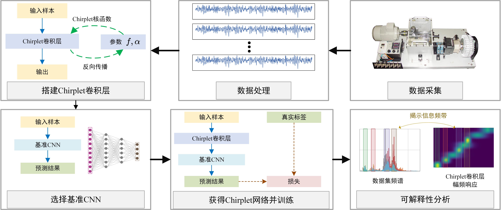
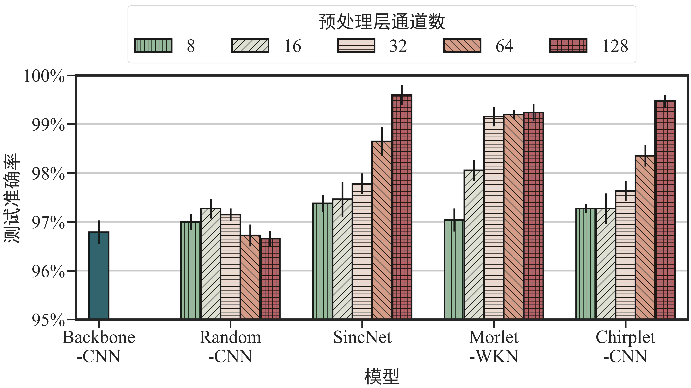
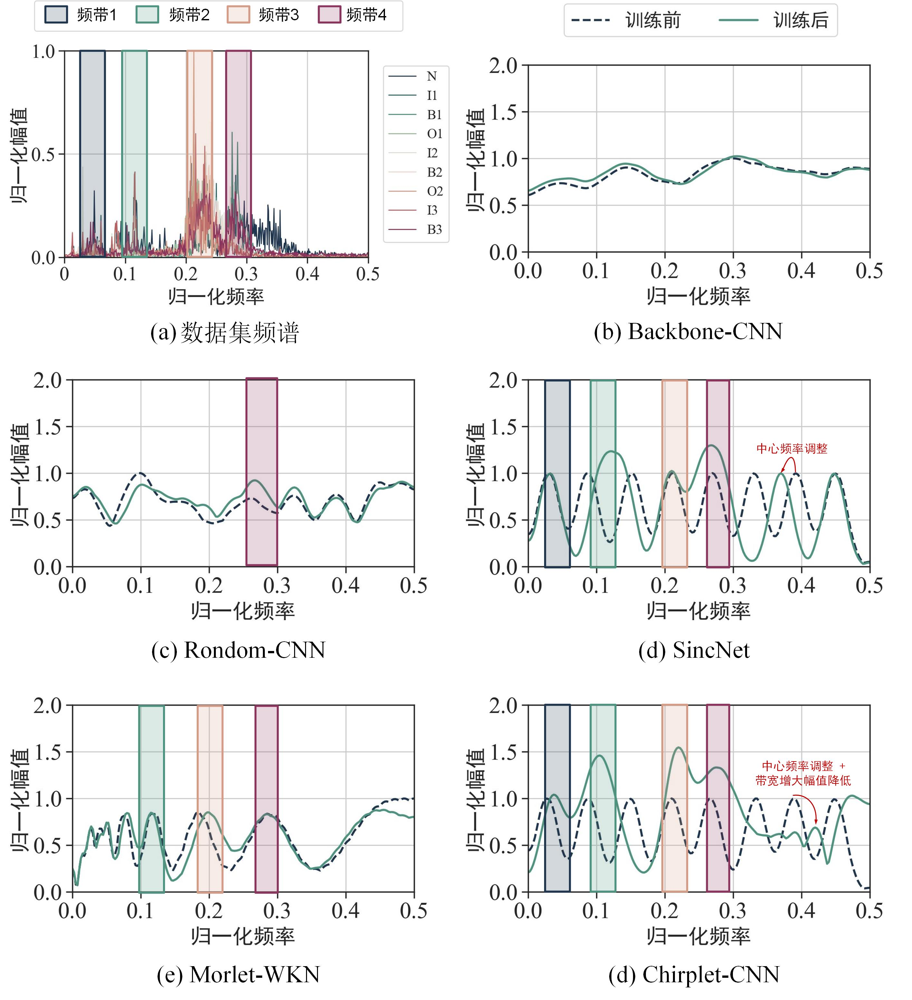
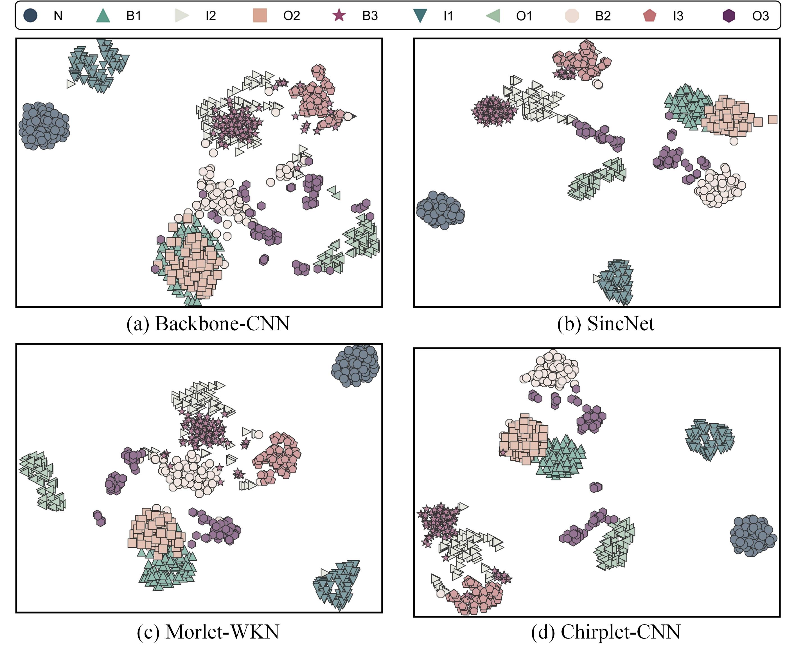
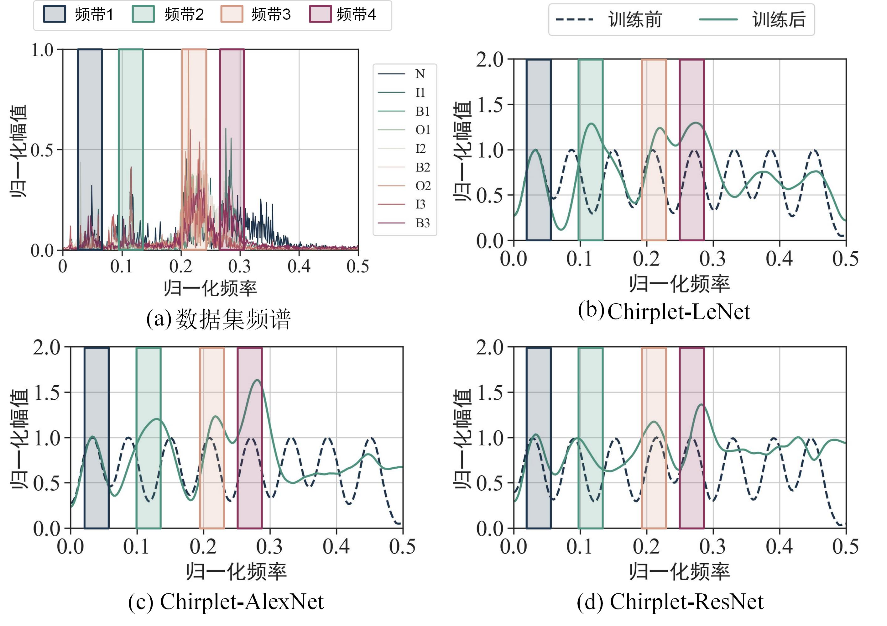

# 一种面向机械设备故障诊断的可解释卷积神经网络

> **陈钱**, 等. 一种面向机械设备故障诊断的可解释卷积神经网络[J]. 机械工程学报, 2023.   **Q. Chen**, et al. An interpretable convolutional neural network for mechanical equipment fault diagnosis[J]. Journal of Mechanical Engineering, 2023.

## 研究背景

卷积神经网络(Convolutional neural network, CNN)已被广泛应用于机械设备故障诊断任务中，但CNN的卓越分类能力，是建立在“黑箱”表征的低可解释性为代价的基础上的，即难以解释CNN模型提取类别特征和做出判断的依据来源[1]。从用户层面，不具备可解释性的深度学习模型往往难以取得机械设备运维人员的信任，需要引入冗余的诊断方案用以交叉验证，增加实际运维成本；从开发者层面，诊断模型的开发人员不理解追踪模型诊断的逻辑和依据，在错误诊断发生时难以对模型进行针对性调试和改进，从而限制了模型诊断性能的修正和提升；从潜在风险方面，实际故障诊断场景远比实验室数据复杂且难以预料，缺乏可解释性的模型难以保证其在实际工作环境下的表现，存在潜在的误判错判风险。虽然基于深度学习的故障诊断模型已取得一定的工业应用，但缺乏可解释性这一弱点，仍限制了其在关键场景的应用，如航空航天关键部件等高可靠性要求的机械设备。

针对当前机械故障智能诊断缺乏可解释性的现状，我们将视角投向具有明显物理意义的传统信号处理方法。传统信号处理方法和神经网络相结合的方向已涌现出不少成果，信号处理赋能神经网络[2,3]是其中的代表性工作。这类网络融入了传统信号处理方法的先验知识，且将信号处理方法的参数设为网络的可训练变量，解决了传统诊断方法参数优化难的问题，在机械故障诊断任务中通常能够取得更为优异的诊断表现。然而，当前的相关工作主要研究这类网络在降噪[4,5]、诊断精度[6]和泛化能力[7]的优异表现，但我们认为这类网络在可解释性上同样存在优势。信号处理方法是具有明确的物理意义，这类网络通过梯度传播对嵌入其中的信号处理方法的重要变量进行优化，这些优化后的变量一方面提高神经网络的故障诊断能力，另一方面也能够借助信号处理理论进行分析，获取优化变量背后对应的物理意义，从而实现对网络的解释。

## 亮点

本文将具有明显物理意义的Chirplet变换和同为内积运算的卷积层相结合，提出能够揭示网络关注频带的Chirplet卷积层。与传统卷积层不同，Chirplet卷积层的权重由Chirplet核函数控制，且Chirplet核函数的参数随着BP过程同步更新，从而自适应地提取更有效的时频特征。将Chirplet卷积层和现有的基准CNN进行组合得到Chirplet-CNN。借助能够有效提取时频特征的Chirplet卷积层，Chirplet-CNN在一系列实验中表现出良好的故障诊断准确性能。本文的主要贡献可总结为：

1. 提出了具有优异可解释性的Chirplet卷积层，能够自适应提取时频特征，从而提高模型的表征学习能力，获得更好的分类表征；
2. 将可解释性的Chirplet卷积层作为预处理层与现有的卷积神经网络相结合得到Chirplet-CNN，提出Chirplet-CNN应用于故障诊断的完整流程。
3. 对训练后的Chirplet卷积层进行频谱分析，能够解释卷积神经网络提取类别特征和做出判断的频带依据；
4. Chirplet卷积层具有良好的通用性，对于不同深度的CNN模型均能一定程度地提高故障诊断准确率。

## 实验方法

 
Chirplet-CNN的完整诊断框架

以私有的行星齿轮箱数据集和开源的CWRU轴承数据集为基础，对所提的Chirplet卷积层开展实验验证。实验结果表明，Chirplet-CNN和当前的先进方法SincNet[8]、Morlet-WKN[2]具有相近的诊断性能，其诊断表现都优于基准CNN和普通卷积层作为预处理层的CNN，有效地说明了所提Chirplet卷积层在故障诊断准确率方面的有效性。

 
Chirplet-CNN和同类方法在CWRU轴承数据集的诊断结果

更进一步地，对Chirplet-CNN和当前先进方法的模型卷积层幅频响应进行分析可知，Chirplet-CNN以其滤波器频率和带宽均可控的特点，所获得的幅频响应能够有效地反映数据集的信息频带，在可解释性方面显著优于当前的先进方法。实验表明，将时频变换方法融入卷积神经网络的操作，在提高模型诊断能力的同时，也为不可解释的神经网络引入了物理可解释性。通过分析网络学习到的参数，获取背后的物理含义，实现对网络的解释，是一条可行的思路。

 
Chirplet-CNN在CWRU轴承数据集的可解释性结果

最后，对所提Chirplet-CNN开展可视化分析和通用性分析。可视化分析结果表明，Chirplet-CNN具有良好的表征能力，所提取的特征同类聚集成簇，异类相互分离，和当前先进方法具有一致表现。

 
Chirplet-CNN和同类方法在CWRU数据集的t-SNE结果

通用性分析结果表明，Chirplet卷积层是一个通用的方法，在不同深度的卷积网络模型上都能有效提取故障时频特征，从而提高基准模型的诊断表现并有效地解释卷积网络模型的关注频带。

| 基准模型 | Chirplet卷积层的通道数 | 平均准确率(%) | 准确率的标准差 |
| -------- | ----------------------- | ------------- | -------------- |
| LeNet    |                         | 90.02         | 0.124          |
|          | 16                      | 91.54         | 0.800          |
|          | 32                      | 94.11         | 0.389          |
|          | 64                      | 94.27         | 0.974          |
|          | 128                     | **94.28**     | 0.625          |
|
| AlexNet  |                         | 97.29         | 0.224          |
|          | 16                      | 97.31         | 0.510          |
|          | 32                      | 97.63         | 0.584          |
|          | 64                      | 97.70         | 0.373          |
|          | 128                     | **97.79**     | 0.494          |
|
| ResNet   |                         | 97.58         | 0.301          |
|          | 16                      | 98.19         | 0.317          |
|          | 32                      | 98.14         | 0.783          |
|          | 64                      | 98.32         | 0.650          |
|          | 128                     | **98.79**     | 0.405          |

 
不同模型为基准的Chirplet-CNN在CWRU数据集的可解释性结果

## 结论

本文提出了能够自适应提取时频特征、具有物理可解释性的Chirplet卷积层，建立了将Chirplet卷积层作为预处理层和现有的CNN结合获得Chirplet-CNN并进行故障诊断的完整流程，在一系列机械设备故障诊断实验中验证了Chirplet-CNN具有良好的诊断准确率和可解释性。结论可总结为：

1. 将Chirplet卷积层和现有的CNN进行结合能有效地提高基准模型在机械故障诊断中的准确率，所提Chirplet卷积层具有与当前先进方法相近的诊断能力；

2. 可通过幅频响应分析，获得Chirplet-CNN所学习参数背后的物理含义，在一定程度上解释了卷积神经网络提取类别特征和做出判断的频带依据；
2. Chirplet卷积层的通道数对Chirplet-CNN准确率表现具有重要影响，应综合考虑诊断精度和诊断效率的需求加以确定。

  在以后的研究中，我们会探索时频变换方法和卷积神经网络的完整融合框架，使得尽可能多的时频变换方法都能和卷积神经网络相融合，在智能诊断的诊断能力、信号降噪和可解释性方面带来更多的成果。

## 参考文献

1. ZHANG Y, TINO P, LEONARDIS A, et al. A survey on neural network interpretability[J]. IEEE Transactions on Emerging Topics in Computational Intelligence, 2021, 5(5): 726-742.

2. LI T, ZHAO Z, SUN C, et al. WaveletKernelNet: an interpretable deep neural network for industrial intelligent diagnosis[J]. IEEE Transactions on Systems, Man, and Cybernetics: Systems, 2022, 52(4): 2302-2312.

3. SHANG Z, ZHAO Z, YAN R. Denoising fault-aware wavelet network: a signal processing informed neural network for fault diagnosis[J]. Chinese Journal of Mechanical Engineering, 2023, 36: 9.

4. ZHAO B, CHENG C, TU G, et al. An interpretable denoising layer for neural networks based on reproducing kernel hilbert space and its application in machine fault diagnosis[J]. Chinese Journal of Mechanical Engineering, 2021, 34: 44.

5. MICHAU G, FRUSQUE G, FINK O. Fully learnable deep wavelet transform for unsupervised monitoring of high-frequency time series[J]. Proceedings of the National Academy of Sciences, 2022, 119(8): e2106598119.

6. GANGULY B, CHAUDHURI S, BISWAS S, et al. Wavelet kernel-based convolutional neural network for localization of partial discharge sources within a power apparatus[J]. IEEE Transactions on Industrial Informatics, 2021, 17(3): 1831-1841.

7. LIU C, QIN C, SHI X, et al. TScatNet: an interpretable cross-domain intelligent diagnosis model with antinoise and few-shot learning capability[J]. IEEE Transactions on Instrumentation and Measurement, 2021, 70: 3506110.

8. RAVANELLI M, BENGIO Y. Speaker recognition from raw waveform with SincNet[C]. 2018 IEEE Spoken Language Technology Workshop (SLT). Athens, Greece: IEEE, 2018: 1021-1028.

